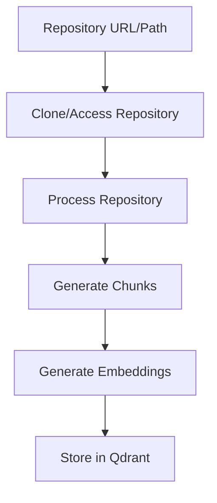

# Repository Indexing Pipeline

This document details the step-by-step process of how repo-indexer processes and indexes a repository. Understanding this pipeline helps identify potential improvements and optimization opportunities.

## Pipeline Overview



## Detailed Steps

### 1. Repository Access
- Input: Repository URL (HTTPS/SSH) or local path
- Tool: `gitingest` library
- Process:
  * For remote repos: Clone to temporary directory
  * For local repos: Direct access
- Output: Repository content as a single string with file markers

### 2. Content Processing
- Input: Raw repository content with file markers
- Process:
  * Split content by file markers
  * Extract file paths and content
  * Filter files based on:
    - File size limits
    - Include/exclude patterns
    - Binary file detection
- Output: List of (filepath, content) pairs

### 3. Chunking
- Input: File content by type
- Process by file type:
  * Code files (.py, .js, etc.):
    - Detect class/function boundaries
    - Preserve context (e.g., class name for methods)
    - Handle nested structures
  * Documentation (.md, .rst):
    - Split by sections
    - Preserve headers as context
  * Configuration files:
    - Split by logical blocks
    - Preserve structure
- Chunk size controls:
  * Target size: 400 characters
  * Overlap: 50 characters
  * Max tokens: 512
- Output: List of Chunk objects with:
  ```python
  {
      "content": str,          # The actual content
      "source_file": str,      # Original file path
      "chunk_type": str,       # code/documentation/configuration
      "start_line": int,       # Starting line number
      "end_line": int,         # Ending line number
      "context": Optional[str] # Parent class/function/section
  }
  ```

### 4. Embedding Generation
- Input: List of content chunks
- Process:
  * Batch processing (default batch_size=32)
  * Support multiple providers:
    - OpenAI (text-embedding-ada-002)
    - Local E5 model
    - Custom providers
  * Fallback handling for errors
- Output: List of embedding vectors

### 5. Vector Storage
- Input: Chunks and their embeddings
- Process:
  * Create Qdrant collection if needed
  * Generate point IDs
  * Create payload from chunk metadata
  * Batch upsert (default batch_size=100)
- Output: Stored vectors with metadata in Qdrant

## Example Pipeline Output

Here's an example of how a Python file gets processed:

```python
# Input: test.py
class Calculator:
    """A simple calculator class."""

    def add(self, a: int, b: int) -> int:
        """Add two numbers."""
        return a + b

    def subtract(self, a: int, b: int) -> int:
        """Subtract b from a."""
        return a - b
```

### After Chunking:
```python
[
    {
        "content": "class Calculator:\n    \"\"\"A simple calculator class.\"\"\"\n",
        "source_file": "test.py",
        "chunk_type": "code",
        "start_line": 1,
        "end_line": 2,
        "context": "class Calculator"
    },
    {
        "content": "def add(self, a: int, b: int) -> int:\n    \"\"\"Add two numbers.\"\"\"\n    return a + b",
        "source_file": "test.py",
        "chunk_type": "code",
        "start_line": 4,
        "end_line": 6,
        "context": "class Calculator"
    },
    {
        "content": "def subtract(self, a: int, b: int) -> int:\n    \"\"\"Subtract b from a.\"\"\"\n    return a - b",
        "source_file": "test.py",
        "chunk_type": "code",
        "start_line": 8,
        "end_line": 10,
        "context": "class Calculator"
    }
]
```

### After Vector Storage:
```python
{
    "id": "unique_id",
    "vector": [...],  # 1536-dim vector for OpenAI
    "payload": {
        "content": "def add(self, a: int, b: int) -> int:\n    \"\"\"Add two numbers.\"\"\"\n    return a + b",
        "source_file": "test.py",
        "chunk_type": "code",
        "start_line": 4,
        "end_line": 6,
        "context": "class Calculator"
    }
}
```

## Potential Improvements

1. Chunking Strategy:
   - Smarter code splitting based on AST parsing
   - Better handling of cross-references
   - Language-specific optimizations

2. Context Preservation:
   - Track imports and dependencies
   - Maintain class hierarchy information
   - Include type information where available

3. Performance:
   - Parallel processing for large repositories
   - Smarter batching based on content size
   - Caching for frequently accessed content

4. Content Analysis:
   - Detect code quality metrics
   - Extract semantic relationships
   - Identify similar code patterns

5. Storage Optimization:
   - Compression for large payloads
   - Efficient update strategies
   - Version tracking for changes
